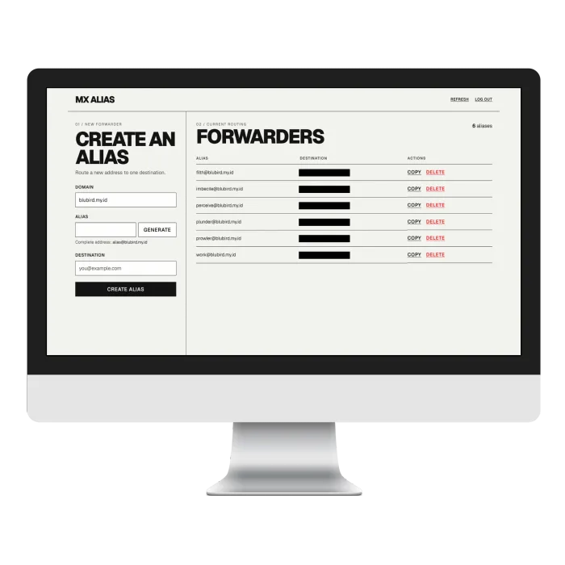
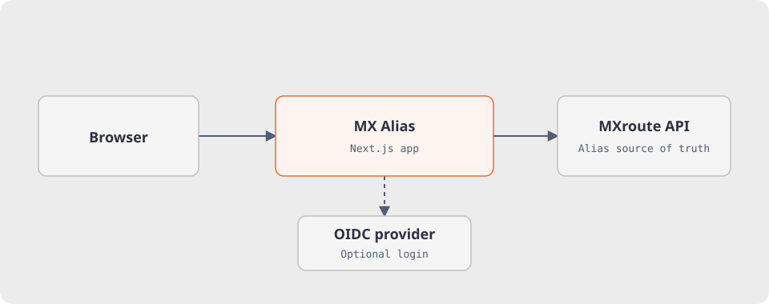

# MX Alias

Self-hosted email alias manager for [MXroute](https://mxroute.com/). Create, generate, copy, and delete forwarding aliases in a web UI with password or optional OIDC login.




No application database: MXroute stores the aliases. The app keeps a temporary read cache and refresh cooldown in memory.

## Prerequisites

- **Node.js 24** (`>=24 <25`, enforced in `package.json` engines)
- **MXroute account** with API access (server, username, API key)
- HTTPS through a reverse proxy (Caddy, Nginx, etc.) in production; session cookies use `Secure` there

## Getting Started

Create `.env` from the template. Generate a secret with `openssl rand -hex 32` and set it as `SESSION_SECRET`:

```bash
cp .env.example .env
```

| Variable | Description |
|---|---|
| `MXROUTE_SERVER` | MXroute server value from your account, sent as the `X-Server` API header (not a URL) |
| `MXROUTE_USERNAME` | MXroute account username |
| `MXROUTE_API_KEY` | MXroute API key |
| `ADMIN_PASSWORD` | Password for the web UI login |
| `SESSION_SECRET` | Random string ≥ 32 chars |

All five are required at runtime. The MXroute API URL is `https://api.mxroute.com` by default; `MXROUTE_BASE_URL` overrides it for testing.

Optional: set `DISALLOWED_DOMAINS` to a comma-separated list of domains that cannot be used as forwarders (e.g. `DISALLOWED_DOMAINS=example.com,internal.test`). Disallowed domains are hidden from the UI and rejected server-side. Leave empty to allow all domains.

### OIDC login (optional)

You can also sign in through an OIDC provider (e.g. [Pocket ID](https://github.com/pocket-id/pocket-id)). Create an OIDC client there:

1. Name the client (e.g. `MX Alias`).
2. Set the callback URL to `https://<your-domain>/api/auth/callback`.
3. **Enable PKCE** on the client.
4. Copy the **Client ID** and **Client Secret**.

Then set all four variables in `.env` — they must be set together:

| Variable | Description |
|---|---|
| `OIDC_ISSUER_URL` | OIDC issuer base URL (e.g. `https://id.example.com`) |
| `OIDC_CLIENT_ID` | Client ID from the OIDC client |
| `OIDC_CLIENT_SECRET` | Client Secret from the OIDC client |
| `OIDC_ALLOWED_EMAIL` | Login email allowed to sign in |

Leave all four empty to disable; password login still works either way.

## Local Development

```bash
npm ci
npm run dev
```

Open <http://localhost:3000>.

## Docker

Build and run with Compose after filling in `.env` as described above:

```bash
docker compose up -d
```

> [!NOTE]
> `docker-compose.yml` passes only the five required variables. To use `DISALLOWED_DOMAINS` or OIDC with Compose, add those variables to the service's `environment` block.

Or build and run manually:

```bash
docker build -t mx-alias .

docker run -d \
  -p 3000:3000 \
  -e MXROUTE_SERVER=your-mxroute-server \
  -e MXROUTE_USERNAME=your-username \
  -e MXROUTE_API_KEY=your-api-key \
  -e ADMIN_PASSWORD=your-password \
  -e SESSION_SECRET=$(openssl rand -hex 32) \
  --name mx-alias \
  mx-alias
```

The image is multi-stage, runs as non-root (`nextjs:1001`), and includes a `/health` endpoint checked every 30s.

## Testing

```bash
npm run lint          # ESLint
npm run typecheck     # TypeScript strict check
npm test              # Unit tests (vitest)
npm run test:e2e      # E2E tests (Playwright)
```

Full local gate in one shot:

```bash
npm run lint && npm run typecheck && npm test && npm run build
```

> [!NOTE]
> The Playwright E2E suite starts its own mock MXroute API and app using the settings in `playwright.config.ts`; it does not need a real MXroute account.

## Architecture



- `app/` — Next.js App Router: pages, server actions, health endpoint
- `components/` — Client components (alias form, forwarder list)
- `lib/` — Business logic: MXroute API client, validation, session handling, security
- `tests/` — Unit and E2E tests

Password and optional OIDC login both issue HMAC-signed session tokens in `httpOnly` cookies. Mutating actions check the session, request origin, and input before calling MXroute.

MXroute reads use `unstable_cache`: domains expire after 5 minutes and forwarders after 60 seconds. Successful writes invalidate the affected domain's forwarder cache. Refresh invalidates the domain list and selected domain's forwarders, with a 15-second per-session cooldown. The cache and cooldown are local to each app instance; allow for that if deploying multiple instances.

Production requires HTTPS for the `Secure` session cookie.
